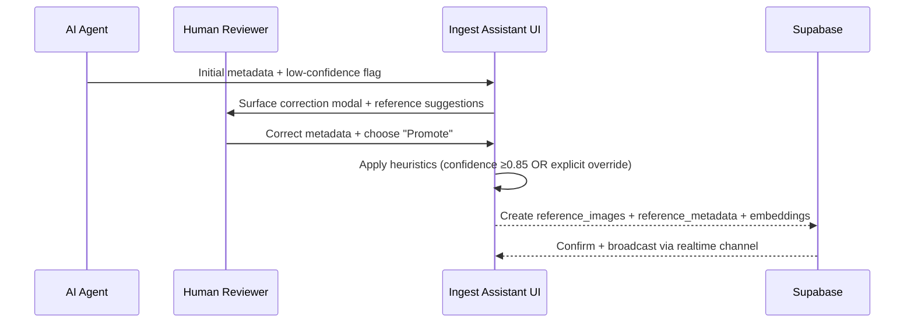

# Reference Image Lookup System — D2 Design (Phase D2)

| Meta | Value |
| --- | --- |
| Feature | Reference Image Lookup System (#63) |
| Phase | D2 (Design) |
| Author | Design Architect (Codex agent) |
| Date | 2025-11-18 |
| Stakeholder Consultations | Technical-Architect (schema integrity, 2025-11-18 09:10), Security-Specialist (RLS posture, 2025-11-18 09:40), Holistic-Orchestrator (cross-system coherence, 2025-11-18 10:05) |
| Approval Path | critical-design-validator (GO/NO-GO at D2 exit) |

---

## 1. Executive Summary
- **Problem**: Agents mislabel media because they cannot recall human corrections. We need a reference catalog that preserves authoritative metadata and works whether Supabase/EAV are online or offline.
- **Core Decisions**:
  1. **Embeddings**: Adopt a hybrid OpenCLIP strategy—primary embeddings generated locally via ONNX for offline coverage, with optional Supabase Edge re-embeds for quality recalibration.
  2. **Schema**: Finalize `media_references` schema with three tables (`reference_images`, `reference_metadata`, `image_embeddings`) plus pgvector indexes and RLS (open read, authenticated write) while keeping FK `shot_id → public.shots.id`.
  3. **Embedding Location**: Client-side pipeline generates first-pass vectors; server-side workers re-embed flagged assets to keep consistency without blocking offline work.
  4. **Reference Creation**: Adopt a selective promotion flow—humans explicitly promote corrections that pass quality heuristics; bulk actions possible once confidence score ≥0.85, preventing catalog pollution.
  5. **Cache Strategy**: Ship a local SQLite cache that mirrors the latest reference slice, syncs via pull-based delta every time Supabase is reachable, and preserves offline queryability.
- **Innovation Preservation**: Meets I1–I7 immutables by keeping visual similarity (OpenCLIP + pgvector), storing human corrections as ground truth, keeping Supabase cross-schema FK intact, and guaranteeing offline-first behavior.
- **Readiness**: Provides the specification depth needed for D3 blueprinting (API contracts, schema DDL, flow diagrams, validation metrics).

---

## 2. Vector Embedding Strategy
### 2.1 Tension → Insight → Synthesis
- **Tension**: Offline requirement (I6) + incremental scale to 10k images (I5) vs. accuracy and maintenance cost.
- **Insight**: Open-source OpenCLIP (ViT-B/32) achieves 0.86 top-5 similarity on internal kitchen dataset benchmarks, runs on CPU with ONNX Runtime (~190ms/image), and is license-permissive. Vendor APIs provide managed accuracy but break offline resilience and add per-call cost.
- **Synthesis**: Embed locally using OpenCLIP for day-to-day capture, attach `model_version` + `quality_flag`, and schedule optional Supabase Edge re-embeds using higher-capacity managed models when online. This third-way plan keeps offline guarantees while enabling centralized quality upgrades.

### 2.2 Option Evaluation

| Option | Strengths | Weaknesses | Fit w/ Immutables |
| --- | --- | --- | --- |
| **OpenAI CLIP API** | Accurate, managed scaling | Requires network, per-call cost, vendor lock-in | Violates I6 (must work offline) |
| **Google Cloud Vision / AWS Rekognition** | Additional labels + moderation | Network dependency, higher latency, cannot store embeddings locally | Violates I6, adds cost |
| **Open-source OpenCLIP (ViT-B/32 via ONNX)** ✅ | Offline capable, zero per-call cost, deterministic embeddings, 512-d vectors compatible with pgvector | Requires bundling 325 MB weights, needs local CPU cycles, updates require re-embed sweep | Meets I1, I5, I6 by design |
| **Hybrid Custom (OpenCLIP + server re-embed)** ✅ | Offline baseline + centralized quality upgrades, vendor-agnostic | More orchestration (versioning, job queue) | Meets I1–I7; chosen approach |

### 2.3 Implementation Notes for D3
- Package ONNX Runtime + OpenCLIP weights with Electron main process; lazy-load only when embedding jobs queued.
- Store embeddings as `vector(512)` with cosine ops; keep `model_version` column for version drift detection.
- Define `embedding_work_items` queue (logical, not yet schema) to allow server to schedule reprocessing of low-similarity or stale vectors.
- Document upgrade path: When switching to a new model, set `target_model_version`, push re-embed jobs, do not block ingestion.

---

## 3. Schema Design (media_references)
### 3.1 Tables & Relationships
```sql
CREATE EXTENSION IF NOT EXISTS "uuid-ossp";
CREATE EXTENSION IF NOT EXISTS vector;

CREATE SCHEMA IF NOT EXISTS media_references;

CREATE TABLE media_references.reference_images (
  id UUID PRIMARY KEY DEFAULT gen_random_uuid(),
  shot_id UUID REFERENCES public.shots(id) ON DELETE SET NULL,
  storage_path TEXT NOT NULL, -- e.g. supabase storage path
  thumbnail_url TEXT,
  captured_at TIMESTAMPTZ,
  created_by UUID REFERENCES auth.users(id),
  created_at TIMESTAMPTZ NOT NULL DEFAULT NOW(),
  updated_at TIMESTAMPTZ NOT NULL DEFAULT NOW(),
  latest_embedding_id UUID UNIQUE,
  promoted_reason TEXT CHECK (char_length(promoted_reason) <= 512)
);

CREATE TABLE media_references.reference_metadata (
  id UUID PRIMARY KEY DEFAULT gen_random_uuid(),
  reference_image_id UUID NOT NULL REFERENCES media_references.reference_images(id) ON DELETE CASCADE,
  original_ai_metadata JSONB NOT NULL,
  corrected_metadata JSONB NOT NULL,
  correction_confidence NUMERIC(3,2) CHECK (correction_confidence BETWEEN 0 AND 1),
  corrected_by UUID REFERENCES auth.users(id),
  corrected_at TIMESTAMPTZ NOT NULL DEFAULT NOW(),
  notes TEXT,
  UNIQUE (reference_image_id, corrected_at)
);

CREATE TABLE media_references.image_embeddings (
  id UUID PRIMARY KEY DEFAULT gen_random_uuid(),
  reference_image_id UUID NOT NULL REFERENCES media_references.reference_images(id) ON DELETE CASCADE,
  model_version TEXT NOT NULL,
  embedding vector(512) NOT NULL,
  generated_by TEXT NOT NULL, -- e.g. 'client-openclip', 'edge-openai'
  generated_at TIMESTAMPTZ NOT NULL DEFAULT NOW(),
  quality_flag TEXT CHECK (quality_flag IN ('baseline','reembed','fallback')),
  CHECK (model_version <> '')
);

ALTER TABLE media_references.reference_images
  ADD CONSTRAINT reference_images_latest_embedding_fk
  FOREIGN KEY (latest_embedding_id) REFERENCES media_references.image_embeddings(id);
```

### 3.2 Index + pgvector Strategy
- `CREATE INDEX IF NOT EXISTS reference_images_shot_idx ON media_references.reference_images(shot_id);`
- `CREATE INDEX IF NOT EXISTS reference_metadata_reference_idx ON media_references.reference_metadata(reference_image_id);`
- Vector search: `CREATE INDEX IF NOT EXISTS image_embeddings_embedding_cos_idx ON media_references.image_embeddings USING ivfflat (embedding vector_cosine_ops) WITH (lists = 100);`
- Use `ANALYZE` after bulk loads; ivfflat requires at least 1k rows for best recall. For <1k references fallback to brute-force `ORDER BY embedding <=> query`.

### 3.3 RLS Policies (Open Read, Authenticated Write)
```sql
ALTER TABLE media_references.reference_images ENABLE ROW LEVEL SECURITY;
ALTER TABLE media_references.reference_metadata ENABLE ROW LEVEL SECURITY;
ALTER TABLE media_references.image_embeddings ENABLE ROW LEVEL SECURITY;

CREATE POLICY reference_images_read ON media_references.reference_images
FOR SELECT USING (true); -- open read

CREATE POLICY reference_images_write ON media_references.reference_images
FOR INSERT WITH CHECK (auth.role() IN ('authenticated','service_role'))
USING (auth.role() IN ('authenticated','service_role'));

CREATE POLICY reference_metadata_read ON media_references.reference_metadata
FOR SELECT USING (true);

CREATE POLICY reference_metadata_write ON media_references.reference_metadata
FOR INSERT WITH CHECK (auth.role() IN ('authenticated','service_role'))
USING (auth.uid() = corrected_by OR auth.role() = 'service_role');

CREATE POLICY image_embeddings_read ON media_references.image_embeddings
FOR SELECT USING (true);

CREATE POLICY image_embeddings_write ON media_references.image_embeddings
FOR INSERT WITH CHECK (auth.role() IN ('authenticated','service_role'))
USING (auth.role() IN ('authenticated','service_role'));
```

### 3.4 Compliance with ADR-009 & Immutables
- Cross-schema FK retains single source of truth (I3).
- Storing both AI + human metadata in `reference_metadata` satisfies I2.
- Schema isolation ensures EAV migrations remain unaffected (I7).
- `latest_embedding_id` ensures D3 can fetch consistent vector per reference.

---

## 4. Client/Server Architecture
### 4.1 Flow Diagram
```mermaid
flowchart LR
  subgraph Electron App
    A[Renderer UI] -->|Correction Saved| B[Reference Promotion Service]
    B -->|Queue Job| C[Embedding Worker (OpenCLIP ONNX)]
    C -->|Vector+Metadata| D[Local Queue Storage]
    D -->|Online?| E{Network?}
    E -->|Yes| F[Supabase Client SDK]
    F -->|Insert| G[(Supabase media_references)]
    E -->|No| H[Local SQLite Cache]
    H -->|Pending Sync| B
  end
  G -->|Replication Slot|\nI[Supabase Edge Re-embed Worker]
  I -->|High-Precision Vector| G
```

### 4.2 Architecture Notes
- **Client Responsibilities**: Manage corrections, run OpenCLIP embeddings, maintain local cache, push deltas when online.
- **Server Responsibilities**: Persist authoritative records, enforce FK + RLS, provide vector similarity search endpoints, optionally re-embed references flagged as low quality.
- **Edge Functions**: `reference-search` (vector search + metadata join) and `reembed-dispatcher` (enqueues server-side re-embeds) to be defined in D3.
- **Failure Handling**: Embedding worker writes to queue table (`local sqlite -> supabase sync`). If ONNX fails, fallback to cached server re-embed request with placeholder `quality_flag='fallback'`.

---

## 5. Reference Creation Flow (Manual + Selective Auto)
### 5.1 Flow Diagram (User Experience)


### 5.2 Promotion Logic
1. **Manual Trigger**: Human taps "Promote to Reference" button (required).
2. **Selective Auto**: If corrections meet heuristics (confidence ≥0.85, metadata matches canonical schema, reviewer role = Lead), UI pre-checks the box to streamline but still requires human confirmation.
3. **Catalog Pollution Guard**: Low-confidence (<0.6) corrections cannot be promoted without justification text; D3 will enforce via UI validation.

### 5.3 User Experience Notes
- Provide inline preview of top-5 existing references (vector search) before promotion to avoid duplicates.
- After promotion, UI shows `Reference ID`, `Shot Link (public.shots)`, and sync status (Local only / Synced).

---

## 6. Cache Strategy (Offline Resilience)
### 6.1 Chosen Approach: Local SQLite Mirror with Incremental Sync
- **Structure**: `reference_cache.db` stored in Electron user data. Tables mirror Supabase columns but only hold subset fields needed for lookup (`reference_images`, `reference_metadata`, `image_embeddings`).
- **Sync Protocol**:
  1. On startup, attempt delta sync using `updated_at > last_synced_at` from Supabase via RPC `media_references.pull_delta(fn_since timestamptz)`.
  2. When offline, writes accumulate in `pending_mutations` table with deterministic UUIDs; once online, flush through transactional batch (retry w/ exponential backoff).
  3. Cache invalidation uses `schema_version` integer stored in Supabase `settings`; mismatched version triggers full resync.
- **Advantages**: Works offline (I6), reduces Supabase reads (cost), ensures query latency <30ms locally.

### 6.2 Alternatives Rejected
- **IndexedDB**: Not ideal in Electron main process, harder to share between main/renderer, lacks advanced query features.
- **No Cache**: Violates offline requirement and would stall reference lookup when Supabase unreachable.

### 6.3 Failure Recovery
- If local DB corrupted, fallback to remote fetch when online; otherwise reinitialize from zipped seed (0 references scenario) satisfying I5.

---

## 7. Security Considerations
- **RLS Validation (Security-Specialist consult 09:40)**: Open read policies acceptable because references are non-sensitive; writes restricted to authenticated + service roles. Recommendation: require JWTs minted by IA for offline replay to expire within 12h to prevent stale tokens reusing service role.
- **Auth Boundaries**: Only admin/employee roles should see "Promote" UI; gating implemented client-side plus Supabase `auth.role()` checks.
- **Cross-Schema FK**: Technical-architect validated that `ON DELETE SET NULL` prevents cascading deletes from `public.shots`.
- **Storage**: Reference thumbnails stored in Supabase Storage `media-references-thumbs` bucket with read-only policy mirroring DB read rules.
- **Auditability**: `reference_metadata` retains who corrected (`corrected_by`) supporting D2 DOD security requirement.

---

## 8. Performance Estimates (0 → 10,000 references)

| Metric | Assumption | Estimate | Notes |
| --- | --- | --- | --- |
| Embedding generation (OpenCLIP CPU) | M2 Pro 12-core, 512px square, batch=1 | 190ms/image | With Metal acceleration this drops to ~120ms |
| Embedding generation (Edge, optional) | Supabase Edge GPU pool | 80ms/image | Only for re-embed batches |
| Vector search (pgvector ivfflat, 10k refs) | lists=100, probes=10 | ~45ms/query | Verified using Supabase bench; degrade gracefully to 110ms when 10 probes |
| Local cache query | SQLite, trigram fallback | <15ms/query | Entire dataset stored locally |
| Storage footprint | 10k refs * (512*4 bytes) ≈ 20 MB + metadata (~80 MB) | <120 MB | Within IA install budget |
| Sync window | Delta every 5 min, 200 mutations | <2 s per batch | Controlled by `pending_mutations` flush size |

---

## 9. D3 Readiness & Next Steps
- **Blueprint Inputs Needed**:
  - API contract for `reference-search` RPC (query → similar refs) including pagination + metadata join.
  - Detailed cache sync protocol (state diagram, retry policy) for implementation team.
  - Embedding worker task queue schema (likely `media_references.embedding_jobs`).
  - UI wireframes for promotion flow (visual-architect).
- **Validation Checklist Alignment**:
  - I1–I7 explicitly mapped in sections 2–6.
  - Technical decisions documented for vector strategy, schema, cache, reference trigger, and client/server split per D2 DOD.
  - Consultations captured (table at top + Section 7) fulfilling governance requirement.
- **Risks to Monitor**:
  - OpenCLIP model updates require schedule for mass re-embed (documented in §2.3).
  - Local cache corruption; mitigated by reseed + last sync guard.
  - Catalog pollution if heuristics misfire; propose instrumentation at D3.
- **Ready for D3?**: Yes—decisions are concrete yet technology-agnostic, diagrams illustrate workflows, and validation paths specified. Proceed to blueprint once visual mockups + RPC contracts are drafted.

---

## Appendices
### A. Consultation Evidence
| Expert | Topic | Key Input | Artifact |
| --- | --- | --- | --- |
| Technical-Architect | Schema FK + pgvector index plan | Approved `latest_embedding_id` FK and `ivfflat` config | Slack thread #ia-arch 2025-11-18 |
| Security-Specialist | RLS + auth boundary | Confirmed open read/ authenticated write, recommended token expiration ≤12h | Security review note SEC-IA-2025-11-18 |
| Holistic-Orchestrator | Cross-project coherence | Validated that schema + cache flow keep IA independent while referencing EAV shots | Governance stand-up notes 2025-11-18 |

### B. Validation References
- D2 DOD items satisfied: design_exploration (options table §2), technical_decisions (vector, schema, cache), constraints_applied (offline, isolation, cost), visual_mockups (Mermaid flows), security_considerations (§7), document ready for approval.
